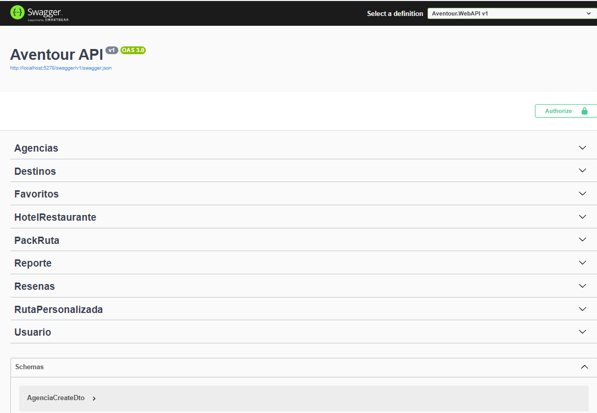

# 🌍 AvenTour Backend — API RESTful de Gestión Turística (.NET 9)

<p align="center">
  
</p>

<p align="center">
  
  
  
  
  
  
  
</p>

Backend de **AvenTour**, una plataforma de gestión turística enfocada en servicios de **Arequipa, Perú**: rutas, experiencias y reservas. Está construido sobre **.NET 9** y sigue estrictamente los principios de **Arquitectura Hexagonal (Puertos y Adaptadores)** para garantizar mantenibilidad, testabilidad y desacoplamiento entre componentes.

## ✨ Características

- **Auth:** login y registro de usuarios con JWT.
- **Agencias:** gestión de agencias turísticas y guías.
- **Destinos:** CRUD de destinos turísticos.
- **Rutas:** creación de rutas personalizadas y packs.
- **Reseñas:** sistema de valoración de usuarios.

## 🏗️ Arquitectura

El proyecto está modularizado siguiendo el patrón de **Puertos y Adaptadores**:

| Capa | Proyecto (.NET) | Responsabilidad | Dependencias |
| :--- | :--- | :--- | :--- |
| **Domain** | `Aventour.Domain` | Núcleo del negocio: entidades, enums y excepciones de dominio. | *Ninguna (pura)* |
| **Application** | `Aventour.Application` | Casos de uso, servicios, interfaces (puertos), DTOs y mappers. Orquestación de la lógica. | `Aventour.Domain` |
| **Infrastructure** | `Aventour.Infrastructure` | Implementación de adaptadores (base de datos, seguridad, APIs externas). | `Aventour.Application`, `Aventour.Domain` |
| **WebAPI** | `Aventour.WebAPI` | Punto de entrada (adaptador primario): controladores REST y configuración de DI. | `Aventour.Application`, `Aventour.Infrastructure` |

## 🚀 Tecnologías

| Tecnología | Uso |
| :--- | :--- |
| **.NET 9.0** | Framework principal del backend |
| **PostgreSQL** (vía Npgsql) | Base de datos relacional |
| **Entity Framework Core** | ORM con enfoque Code-First |
| **JWT + BCrypt** | Autenticación y hashing de contraseñas |
| **AutoMapper** | Mapeo entre entidades y DTOs |
| **Swagger / OpenAPI** | Documentación interactiva de la API |
| **Docker** | Contenedorización del servicio |

## 📋 Requisitos previos

Antes de ejecutar el proyecto necesitas tener instalado:

- [.NET 9 SDK](https://dotnet.microsoft.com/download) (`dotnet --version` debe mostrar 9.x)
- [PostgreSQL](https://www.postgresql.org/) en ejecución, con una base de datos y credenciales disponibles
- (Opcional) [Docker](https://www.docker.com/) si prefieres ejecutarlo en contenedor
- Un editor/IDE como Visual Studio, Rider o VS Code

## 🛠️ Instalación y ejecución

1. **Clonar el repositorio**

   ```bash
   git clone https://github.com/NinaDIV/AvenTour-Backend-DotNet.git
   cd AvenTour-Backend-DotNet/Aventour
   ```

2. **Restaurar dependencias**

   ```bash
   dotnet restore
   ```

3. **Configurar la conexión a PostgreSQL**

   Ajusta la cadena de conexión en el `appsettings.json` (o `appsettings.Development.json`) de `Aventour.WebAPI` con el host, base de datos, usuario y contraseña de tu instancia de PostgreSQL.

4. **Aplicar las migraciones de EF Core (Code-First)**

   Si aún no tienes la herramienta `dotnet-ef`, instálala primero:

   ```bash
   dotnet tool install --global dotnet-ef
   ```

   Luego aplica las migraciones:

   ```bash
   dotnet ef database update --project Aventour.Infrastructure --startup-project Aventour.WebAPI
   ```

5. **Ejecutar la API**

   ```bash
   dotnet run --project Aventour.WebAPI
   ```

   Al arrancar, la API queda disponible en `https://localhost:7198` y puedes abrir la documentación interactiva de Swagger en:

   ```
   https://localhost:7198/swagger/index.html
   ```

### 🐳 Ejecución con Docker

El repositorio incluye un `Dockerfile` en la raíz:

```bash
docker build -t aventour-backend .
docker run -p 8080:8080 aventour-backend
```

> Nota: 8080 es el puerto por defecto de las imágenes de ASP.NET Core en .NET 9; si el `Dockerfile` expone otro puerto, ajusta el mapeo `-p` en consecuencia.

## 📚 Documentación de la API

La documentación interactiva de los endpoints se genera automáticamente con **Swagger**.

- **URL local:** `https://localhost:7198/swagger/index.html`

## 🧪 Estructura del proyecto

```text
/Aventour
  ├── /Aventour.Domain          # Entidades (Usuario, Destino, etc.)
  ├── /Aventour.Application     # DTOs, interfaces (repositories/services), casos de uso
  ├── /Aventour.Infrastructure  # EF Core Context, implementación de repositorios, lógica JWT
  └── /Aventour.WebAPI          # Controllers, middlewares, Program.cs
```
